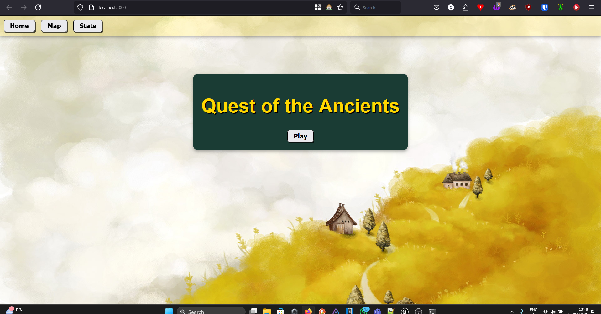
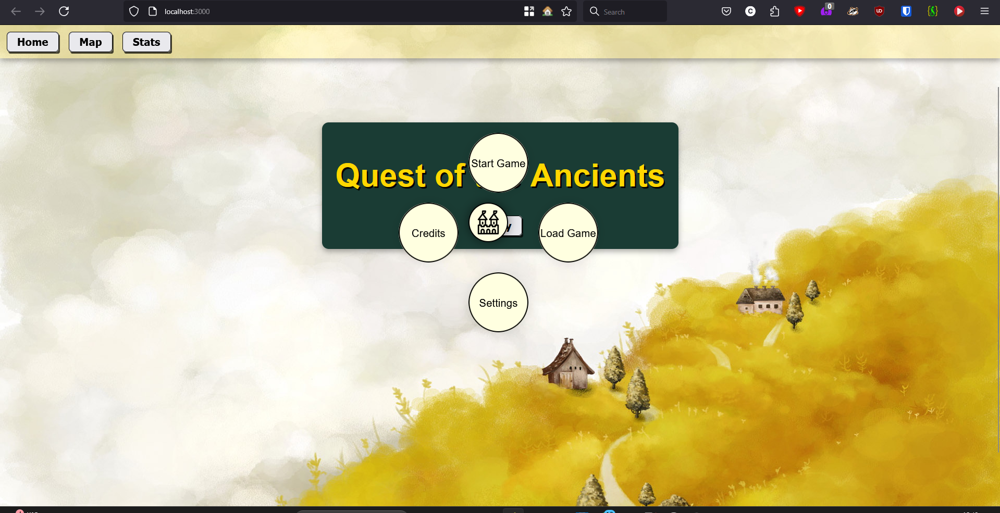
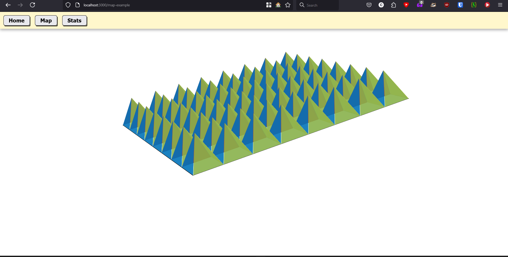
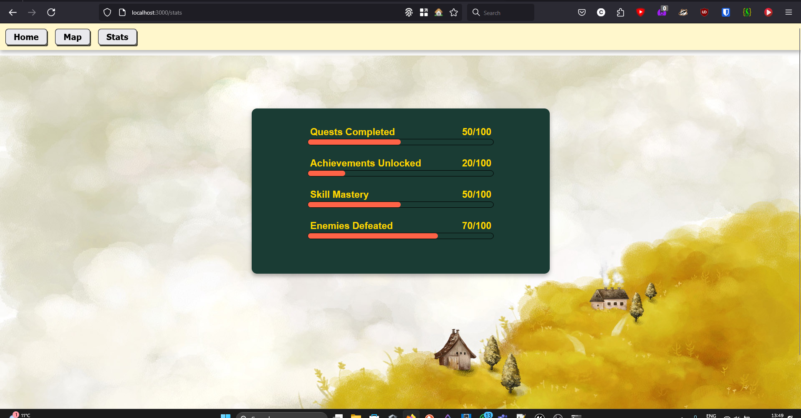

# Quest of the Ancient 🎮

A demo browser game UI built with React.

# Download the 

## Screenshots

1. Home page
	

2. Circular Play Menu
	

3. Map page
	
	
4. Stats page
	

## Build 🛠️

1. Clone:  
   ```bash
   git clone https://github.com/Milind-cod3-base/BrowserGameUI.git
   cd BrowserGameUI
   ```
   
2. Install (Need Node.js pre-installed in PC):
	```bash

	npm install
	```

3. Run:
	```bash
	  npm start
	```
## Features 🌟
	Navigation Bar: Home, Map, Stats.
	Stats Card: Quests, Achievements, Skills.
	Circular Menu: Start, Load, Settings, Credits.